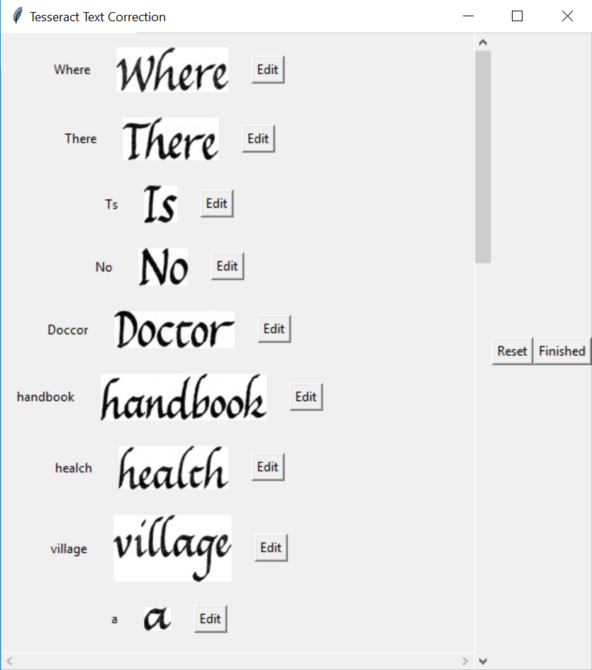
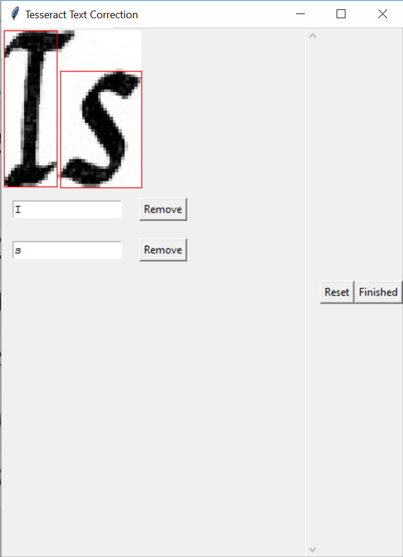
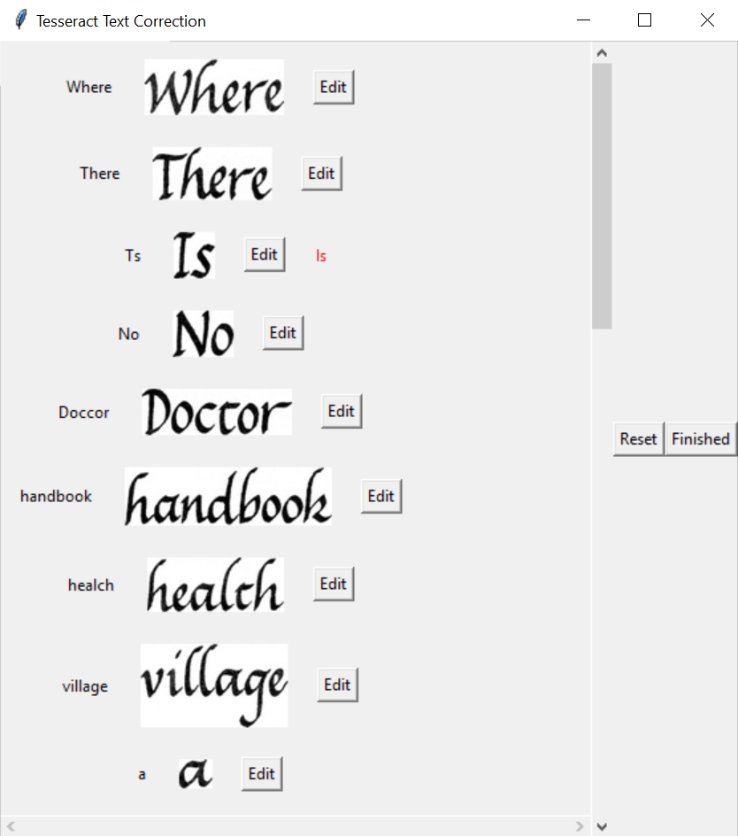

# Tesseract Retraining Pipeline

## Summary

Due to the laborious and manually intensive process involved in fine-tuning a Tesseract model, this pipeline script has been developed to provide a streamlined path from identifying incorrectly OCR'd words to retraining and deploying an updated Tesseract model capable of addressing the shortcomings of the previous model.

The general retraining process goes:

1. Move your existing Tesseract model into the proper subdirectory.
2. Generate line-box file pairs, where each file pair represents one word that you want to correct in the Tesseract model. The line file contains the proper text in the subimage, while the box file contains the coordinates of each character in the line.
3. Generate a unicharset file from the line-box files.
4. Generate LSTMF files from the line-box files and divide the LSTMF files into training and evaluation sets.
5. Retrain the Tesseract model with the LSTMF files.

Steps 3-5 have been fully automated, with full credit going to Kamil Ciemniewski:

https://www.endpoint.com/blog/2018/07/09/training-tesseract-models-from-scratch

Steps 1 and 2, however, are a partially manual process, though the script does make a best effort to automate as much of the manual work as possible.

The following sections outline the requirements needed to run the pipeline, each step in the pipeline itself, how to best use the script to complete each step, and common issues encountered during the process.

## Requirements

`requirements.txt` contains the Python dependencies needed to run the script.

This script requires Ghostscript, which can be retrieved from:

https://www.ghostscript.com/download/gsdnld.html

Note that, for Windows, only the 64-bit version is supported at this time.

You will also need an installation of Ruby, which you can get from:

https://www.ruby-lang.org/en/downloads/

Once you have installed Ruby, run the following commands:

`gem install unicode-scripts`  
`gem install unicode-categories`

This will install a couple necessary packages from Gem (Ruby's package manager) that are used to generate the unicharset file in Step 3.

## 1. Moving the Target Tesseract Model

The Tesseract model file that needs to be retrained can be found in your `tessdata` folder where Tesseract is installed, and has the filename format `<lang>.traineddata`

For Windows, this is often `C:\Program Files (x86)\Tesseract-OCR\tessdata`

Copy this file into this repository's `<lang>/tessdata` directory. For instance, if you want to retrain the English-language Tesseract model, then you should copy `eng.traineddata` from the Tesseract installation's `tessdata` folder to the `eng/tessdata` folder in this repository.

## 2. Generating Line-Box Files

The first step is largely a manual process due to the fact that Tesseract is unable to correctly identify the contents of the word and its character bounds, hence the need to retrain the model in the first place. However, this script does help make the process of building line-box files easier. Rather than try to manually convert a PDF page to an image, manually crop desired words out of the image, and manually identify the left, right, top, and bottom coordinates of every individual character, a GUI allows the user to select a page from the PDF to automatically convert to an image, draw any bounding boxes needed, and draw any needed character-level bounding boxes, subsequently generating all line-box files automatically.

To execute this step in the pipeline, simply run the script without any additional arguments:

`python pipeline.py`

Alternatively, you may run:

`python pipeline.py -b`

### Selecting PDF Pages

When the script first launches in line-box mode, a dialog will appear asking you to select a PDF. Go ahead and select the PDF containing the words that you want to fix.

The command line will now ask which page you want to work with. Enter the page with the words you want to fix and hit Enter. Don't worry if there are multiple pages you want to work with; after you're done with each page, the script will allow you to select another PDF file and page.

The script will now convert the PDF page into an image and run Tesseract on it. Note that this process may take time, as Tesseract is run on both the word level and the character level, with an additional algorithm applied to identify any potential words that Tesseract may have missed on its first pass.

### Drawing Bounding Boxes

When Tesseract has finished reading a page, a window will launch showing the page you selected with bounding boxes drawn around each word that Tesseract identified. This purpose of this step in the process is to select any words that Tesseract may have missed. Most of the time, the issue is with Tesseract incorrectly identifying the characters of the word, rather than missing the word in its entirety, so you can often just click "Finished" and move onto the next step.

If you need to draw boxes around any missed words, however, it is intuitive enough: simply click and drag on the image with your mouse to draw a box around the word. Make sure to leave a little bit of whitespace around the word if at all possible, as Tesseract tends to train better with some surrounding whitespace, but if that is not possible due to the density of the words in the image, then simply do your best to capture the word.

There are three buttons on the GUI: `Undo`, `Reset`, and `Finished`. Clicking `Undo` will delete the most recent box that you have drawn. Clicking `Reset` will remove all boxes that you have drawn, only leaving the initial boxes identified by Tesseract when the window was first loaded. Clicking `Finished` will save all progress and move onto the next step.

### Word Corrections

The next window is a list of every word that was captured by a bounding box. Each entry contains the cropped subimage from the bounding box along with what Tesseract thinks that subimage says and, in certain cases, the text of the image in red (see the next paragraph for more details on that). As you scroll through each word, if you notice a word that has not been properly read, you can click the accompanying `Edit` button to open a window allowing you to make any corrections. Note that any bounding boxes that you manually drew in the last step will appear at the top of the list. The ordering for the rest of the list is top-to-bottom, left-to-right.

If any entry in the list contains text in red, this means that the entry will be made into a line-box file after you click `Finished`. The red text contains the text that you have corrected. When you manually draw a bounding box around an image, Tesseract will make an effort to identify what it says, and it will be included in the list of line-box files to be generated (i.e. its text will display in both black and red in the list).

This window contains two additional buttons on the right: `Reset` will reset every single word that you have edited and will restore the window back to its initial state, and `Finished` will save your modifications and generate line-box files for every word in the list that has a red text entry. Closing the window by clicking the `X` will simply return you to the initial PDF selection prompt and will not save your modifications nor generate any line-box images.

#### Character Corrections

If you click the `Edit` button for any entry in the list, a window will pop up allowing you to make any corrections to the word and/or its bounding boxes for each character. The subimage will be displayed in its full size, and each character's bounding box will be drawn over the image. For every bounding box around a character, an accompanying text field is displayed below the image with the character's value. To delete a bounding box, click `Remove` for the associated text field. To add a new bounding box, simply click and drag your mouse to draw a box around the desired character. An empty text field will automatically be added to the list of characters below, where you can then insert the character. The text fields associate themselves with bounding boxes in a left-to-right fashion, so any new text fields will insert themselves in the appropriate order in the list based on the left side of your drawn bounding box.

If you need to insert a space in your word, then draw a bounding box around where the space should be, and simply hit the space bar for the text field. This should generally not be needed, but could be necessary if there is a case in which Tesseract grouped two words together that should have actually been multiple words, and you need to correct it by adding a space.

If you need to insert a new line in a word, then draw a small bounding box to the right of the last character in the line, and then insert a tab in the accompanying text field. Note that the need for this functionality is why hitting tab will insert an actual tab into the text field, rather than changing the focus to the next text field.

As with the previous word-level bounding boxes, make a best effort to leave a few pixels of whitespace around each character if at all possible. This helps Tesseract better identify the character during the training process. If you are unable to do so, simply make a best effort to capture as much of the character as possible.

The `Edit` window has two buttons: `Reset` will reset the word to its original characters and bounds as originally identified by Tesseract, and `Finished` will save your modifications for the word and return to the previous window listing each entry in the image. **Note that, if you click X to close the window, none of your current changes made will be saved.** This is useful if, for example, you edit a word, click Finished, reopen the window to edit the word again, and make some changes, but don't want to save these new changes and don't want to reset the changes made on the first edit.

Tesseract does not always accurately identify the proper bounding boxes for characters. **If a word is extracted 100% correctly by Tesseract already, do not make any modifications to its bounding boxes in an attempt to fix them!** This script is only used to handle Tesseract's identification of the characters in an image, and as long as the word is properly extracted, nothing needs to be done to correct it. The only exception to this rule is if you manually drew a bounding box to capture a missed word, and Tesseract was able to properly identify it after the fact (i.e. you drew the box in the last window, and the text is now correctly appearing red in this window, but the bounding boxes for each character are incorrect). If you manually drew a bounding box around a word and Tesseract correctly identified the word but didn't perfectly identify the bounding boxes for each character, then you should correct the character-level bounding boxes for the word. Further, if you need to correct a word in Tesseract (even if it's just to add a space between two erroneously grouped words), then you **must** correct the bounding boxes of all other characters if they are not accurate, even if the character itself was extracted properly. This is because, when Tesseract is retrained at the end of the pipeline, it will take into account all characters in the image, not just the characters that you have added or removed, and it will train itself accordingly.

If any changes are made to a word, then the new word will be displayed in red to the right of the original word in the word list window.

### Selecting More PDF Pages

After you have clicked `Finished` or closed the window, you will be returned to the initial PDF selection prompt. Enter `y` to continue with another PDF (if you want to continue with the same PDF and another page, simply select the same PDF as last time from the dialog and enter the new page), or hit Enter without typing anything if you are done.

***Before moving onto the next step, make sure that you have generated as many line-box images as possible! These line-box images make up your training and evaluation sets, and if you don't have enough, then the model risks overfitting. As a general rule of thumb, if you aren't sure whether you have enough line-box images to run the post-processing scripts, then the answer is that you should not run them. If you are confident that you have enough line-box images to retrain the Tesseract model, then you may proceed below. Finally, make sure that these next steps are done in a Linux environment. Although most of the pipeline is supported in Windows, the retraining itself must be done in Linux, so the final file generations used for retraining might as well be done in a Linux environment as well.***

## 3. Generating the Unicharset File

To generate the unicharset file, run the following command:

`python pipeline.py -n`

This generates the unicharset file from all line-box images. This script depends on a corresponding Ruby script, so make sure that you have installed all requirements mentioned in the Requirements section.

## 4. Generating the LSTMF Files

To generate all LSTMF files and shuffle them into corresponding training and evaluation sets, run the following command:

`python pipeline.py -f`

This generates one LSTMF file per line-box file pair. A separate script is then run which takes all LSTMF file pointers and shuffles them into training and evaluation sets. These LSTMF files, along with the training and evaluation lists, are used to fine-tune the Tesseract model.

## 5. Retraining the Tesseract Model

To begin the actual retraining process, run the following command:

`python pipeline.py -r`

Depending on how many LSTMF files are used for training, this process could take some time.

Once retraining has been completed, copy the `<lang>.traineddata` model file back to the Tesseract installation's `tessdata` folder from Step 1.

## Running Steps 3-5 Sequentially

Due to the fact that Steps 3-5 are fully automated, they can be run in unison by including the `-p` flag:

`python pipeline.py -p`

The order will run as described above:
* The unicharset file will be generated.
* The LSTMF files will be generated and divided into training and evaluation sets.
* The Tesseract model will be retrained.

## Different Languages

This documentation has covered the fine-tuning of the English-language Tesseract model. To fine-tune a Tesseract model of a different language, simply append `--language <language code>` to **all** Python arguments, including the initial line-box step where no additional arguments need to be provided. `<language code>` **must** match the language code used in the Tesseract traineddata file, e.g. `chi_sim` for simplified Chinese, `chi_tra` for traditional Chinese, `jpn` for Japanese, and so on. For instance, to run the pipeline for the French language, commands can be run like:

`python pipeline.py --language fra`
`python pipeline.py -b --language fra`
`python pipeline.py -p --language fra`

On the file system, all line-box files, post-processing files, models, and so on will be stored in a subdirectory with the language code used in the Python commands. By default, all operations are done on the English model, so corresponding files are stored in the `eng` subdirectory.

## Frequently Asked Questions / Troubleshooting

As this is the initial launch of the Tesseract retraining pipeline, there have not yet been many frequently asked questions or common issues encountered. This section will be updated as time goes on and more use cases or workarounds are needed.

* **What if the page I want to retrain is oriented upside-down or on its side?**

Currently, you will have to manually reorient the page prior to loading it in the line-box file generator. There is a plan to do this automatically in the future, however.

## To Do

* Fully integrate support for the tesserocr library. Currently, support for tesserocr is limited, and as such, `USE_TESSEROCR` is set to `False` by default.
* Add support for auto-orienting pages.
